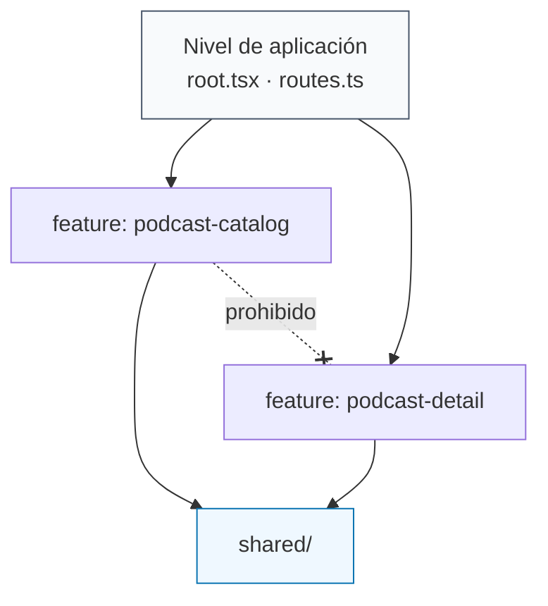
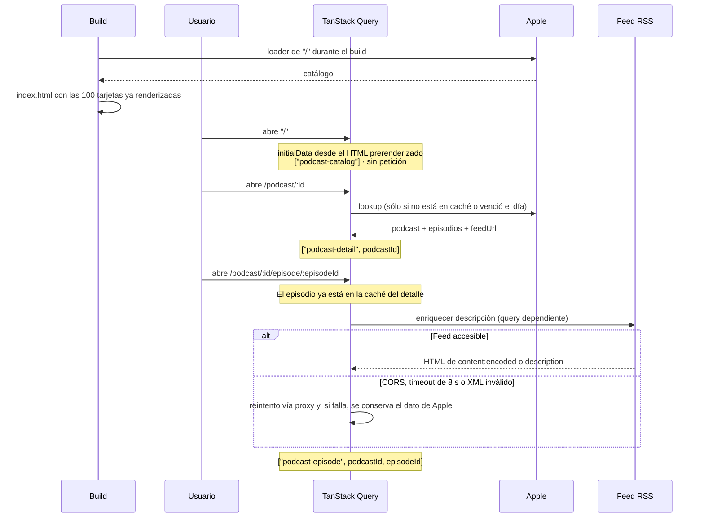
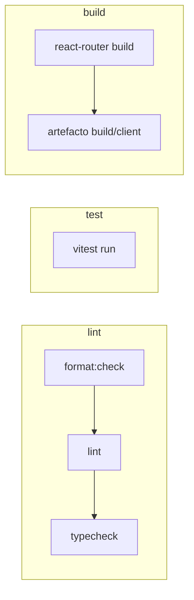

# Podcaster

Una SPA para explorar los 100 podcasts más populares de Apple, navegar por sus episodios y escucharlos, construida como prueba técnica de frontend.


---

## Tabla de contenidos

- [Set up](#Set-up)
- [Guía rápida para quien revisa](#guía-rápida-para-quien-revisa)
- [Trazabilidad: requisitos e implementación](#trazabilidad-requisitos-e-implementación)
- [Stack tecnológico](#stack-tecnológico)
- [Arquitectura](#arquitectura)
- [Flujo de datos y caché](#flujo-de-datos-y-caché)
- [Decisiones de diseño (ADRs)](#decisiones-de-diseño-adrs)
- [Patrones aplicados](#patrones-aplicados)
- [Estrategia de tests](#estrategia-de-tests)
- [Calidad, CI y convenciones](#calidad-ci-y-convenciones)
- [Build y despliegue](#build-y-despliegue)
- [Deuda técnica conocida y trade-offs asumidos](#deuda-técnica-conocida-y-trade-offs-asumidos)
- [Próximos pasos](#próximos-pasos)

---

## Set up

### Requisitos previos

| Herramienta | Versión       | Nota                                                     |
| ----------- | ------------- | -------------------------------------------------------- |
| Node.js     | 24 o superior | La CI usa Node 24                                        |
| pnpm        | 11.9.0        | Fijado en `packageManager`; `corepack enable` lo instala |

### Instalación y arranque

```bash
pnpm install
pnpm dev          # http://localhost:5173
```

No hay variables de entorno ni servicios que levantar: todos los datos vienen de endpoints públicos de Apple y del feed RSS de cada podcast.

### Scripts disponibles

| Script              | Qué hace                                                                           |
| ------------------- | ---------------------------------------------------------------------------------- |
| `pnpm dev`          | Servidor de desarrollo con HMR y módulos sin concatenar ni minificar               |
| `pnpm build`        | Build de producción en `build/`, con code splitting, minificado y prerender de `/` |
| `pnpm start`        | Sirve el build generado                                                            |
| `pnpm test`         | Tests unitarios y de componentes (Vitest)                                          |
| `pnpm test:watch`   | Los mismos tests en watch mode                                                     |
| `pnpm test:e2e`     | Tests end to end (Playwright); hace el build y lo sirve automáticamente            |
| `pnpm typecheck`    | Genera los tipos de rutas y ejecuta `tsc`                                          |
| `pnpm lint`         | ESLint 9 en configuración flat                                                     |
| `pnpm format:check` | Verifica el formato con Prettier                                                   |
| `pnpm format`       | Aplica el formato                                                                  |

Antes del primer `pnpm test:e2e` hay que descargar el navegador:

```bash
pnpm exec playwright install chromium
```

---

## Guía rápida

Si sólo hay tiempo para leer cinco archivos, estos son los que mejor resumen el criterio técnico del proyecto:

| Archivo                                                                                                                                          | Por qué                                                                                             |
| ------------------------------------------------------------------------------------------------------------------------------------------------ | --------------------------------------------------------------------------------------------------- |
| [`app/features/podcast-detail/api/fetchPodcastDetail.ts`](app/features/podcast-detail/api/fetchPodcastDetail.ts)                                 | Validación en el borde con Zod y política de errores diferenciada por tipo de fallo                 |
| [`app/features/podcast-detail/episode/api/fetchEpisodeFromFeed.ts`](app/features/podcast-detail/episode/api/fetchEpisodeFromFeed.ts)             | Enriquecimiento desde RSS con fallback por proxy, timeout y degradación elegante                    |
| [`app/features/podcast-detail/episode/components/EpisodeDescription.tsx`](app/features/podcast-detail/episode/components/EpisodeDescription.tsx) | La única frontera del sistema donde entra HTML de terceros al DOM                                   |
| [`app/features/podcast-catalog/podcastSummaryRoute.test.tsx`](app/features/podcast-catalog/podcastSummaryRoute.test.tsx)                         | El test que demuestra el requisito de caché de 24 horas avanzando el reloj                          |
| [`docs/adr/0006-vertical-slices-by-feature.md`](docs/adr/0006-vertical-slices-by-feature.md)                                                     | El razonamiento de arquitectura completo, incluidas las heurísticas para saber cuándo está fallando |

---

## Trazabilidad: requisitos e implementación

| Requisito                                                 | Dónde está resuelto                                                                                                                                                                                                                                                    | Estado                                  |
| --------------------------------------------------------- | ---------------------------------------------------------------------------------------------------------------------------------------------------------------------------------------------------------------------------------------------------------------------- | --------------------------------------- |
| SPA con tres vistas y navegación de cliente sin recarga   | [`app/routes.ts`](app/routes.ts), [`AppLink`](app/shared/navigation/AppLink.tsx)                                                                                                                                                                                       | ✅                                      |
| Listado de los 100 podcasts más populares                 | [`fetchPodcastCatalog.tsx`](app/features/podcast-catalog/api/fetchPodcastCatalog.tsx)                                                                                                                                                                                  | ✅                                      |
| Filtro por título o autor, con contador de resultados     | [`filterPodcasts.ts`](app/features/podcast-catalog/domain/filterPodcasts.ts), [`usePodcastCatalog`](app/features/podcast-catalog/hooks/usePodcastCatalog.tsx)                                                                                                          | ✅                                      |
| Detalle de podcast con su lista de episodios              | [`podcastDetailRoute.tsx`](app/features/podcast-detail/podcastDetailRoute.tsx), [`EpisodeTable`](app/features/podcast-detail/episode/components/EpisodeTable.tsx)                                                                                                      | ✅                                      |
| Detalle de episodio con reproductor de audio nativo       | [`AudioPlayer.tsx`](app/features/podcast-detail/episode/components/AudioPlayer.tsx)                                                                                                                                                                                    | ✅                                      |
| Descripción del episodio respetando su formato HTML       | [`fetchEpisodeFromFeed.ts`](app/features/podcast-detail/episode/api/fetchEpisodeFromFeed.ts) + [`EpisodeDescription.tsx`](app/features/podcast-detail/episode/components/EpisodeDescription.tsx) — ver [ADR 0007](docs/adr/0007-rich-episode-descriptions-from-rss.md) | ✅                                      |
| Cabecera persistente que enlaza al inicio                 | [`app/root.tsx`](app/root.tsx)                                                                                                                                                                                                                                         | ✅                                      |
| Indicador visible mientras hay una navegación en curso    | [`NavigationIndicator.tsx`](app/shared/navigation/NavigationIndicator.tsx)                                                                                                                                                                                             | ✅                                      |
| No volver a pedir los mismos datos hasta pasadas 24 horas | `staleTime` y `gcTime` de un día + persistencia en `localStorage` — ver [ADR 0002](docs/adr/0002-data-fetching-cache-strategy.md)                                                                                                                                      | ✅                                      |
| Modo desarrollo sin concatenar ni minificar               | `pnpm dev` sirve módulos ES nativos vía Vite                                                                                                                                                                                                                           | ✅                                      |
| Modo producción concatenado y minificado                  | `pnpm build` produce chunks con hash por ruta en `build/client/assets/`                                                                                                                                                                                                | ✅                                      |
| CSS escrito desde cero                                    | Se usa Tailwind. La tensión con el criterio se asume y se argumenta de forma explícita en [ADR 0004](docs/adr/0004-styling-with-tailwind.md)                                                                                                                           | ⚠️ Divergencia razonada                 |
| Server Side Rendering (criterio adicional)                | No hay renderizado por petición. Se prerenderiza `/` en build. Ver [ADR 0001](docs/adr/0001-application-framework.md)                                                                                                                                                  | ⚠️ Objetivo cubierto por otro mecanismo |

Las dos filas marcadas con ⚠️ son divergencias deliberadas, no descuidos. Cada una tiene su ADR explicando qué se ganó, qué se perdió y bajo qué condiciones habría que revertir la decisión.

**Evidencia del prerender.** El build genera dos HTML distintos y la diferencia es medible:

```bash
$ grep -c 'href="/podcast/' build/client/index.html          # 100
$ grep -c 'href="/podcast/' build/client/__spa-fallback.html  #   0
```

`index.html` (152 KB) llega al navegador con las 100 tarjetas ya renderizadas; `__spa-fallback.html` (79 KB) es el shell vacío que el hosting sirve para las rutas dinámicas. La ruta con más tráfico no tiene estado de carga inicial y aun así no hay ningún servidor que mantener.

---

## Stack tecnológico

| Capa               | Elección                                                   | Por qué (resumen)                                                                                                                                          |
| ------------------ | ---------------------------------------------------------- | ---------------------------------------------------------------------------------------------------------------------------------------------------------- |
| Framework          | React 19 + React Router 8 en modo framework                | Rutas tipadas, code splitting y modelo `Component`/`loader`/`action` sin exigir un runtime de servidor. [ADR 0001](docs/adr/0001-application-framework.md) |
| Build              | Vite 8 con el plugin de React Router                       | Una sola canalización para dev, build y tests                                                                                                              |
| Lenguaje           | TypeScript 5.9 en `strict`                                 | Además: `noUncheckedIndexedAccess`, `exactOptionalPropertyTypes`, `verbatimModuleSyntax`, `noUnusedLocals`                                                 |
| Estado de servidor | TanStack Query 5 + persistencia en `localStorage`          | Frescura, deduplicación, GC y persistencia resueltas por una librería especializada. [ADR 0002](docs/adr/0002-data-fetching-cache-strategy.md)             |
| Validación         | Zod 4                                                      | Contrato en runtime para datos que no controlamos. [ADR 0003](docs/adr/0003-external-data-validation-with-zod.md)                                          |
| Estilos            | Tailwind CSS 4 con tokens propios en `@theme`              | Escala visual consistente sin construir un framework de utilidades propio. [ADR 0004](docs/adr/0004-styling-with-tailwind.md)                              |
| Parseo de RSS      | `fast-xml-parser` 5                                        | Normaliza namespaces, CDATA y atributos sin lógica DOM manual. [ADR 0007](docs/adr/0007-rich-episode-descriptions-from-rss.md)                             |
| Sanitización       | DOMPurify 3                                                | El HTML de un feed es contenido no confiable                                                                                                               |
| Tests              | Vitest 4, Testing Library, `user-event`, MSW 2, Playwright | Tres niveles con responsabilidades distintas. [ADR 0005](docs/adr/0005-testing-strategy-and-tooling.md)                                                    |
| Calidad            | ESLint 9 flat config, Prettier, GitHub Actions             | Formato, lint, tipos, tests y build verificados en cada PR                                                                                                 |

### Fuentes de datos

| Recurso             | Origen                                                                           |
| ------------------- | -------------------------------------------------------------------------------- |
| Catálogo            | `itunes.apple.com/us/rss/toppodcasts/limit=100/genre=1310/json`                  |
| Detalle y episodios | `itunes.apple.com/lookup?id=…&media=podcast&entity=podcastEpisode&limit=200`     |
| Descripción HTML    | El `feedUrl` del propio podcast, con `api.allorigins.win/raw` como fallback CORS |

---

## Arquitectura

### Vertical slices por feature

El repositorio se organiza por **capacidades de producto**, no por tipo técnico de archivo. La razón es directa: un cambio de producto ("permitir marcar favoritos", "recordar el progreso de escucha") atraviesa UI, reglas, datos y tests a la vez. Si esos archivos viven en `components/`, `hooks/`, `services/` y `api/` globales, implementar una sola capacidad obliga a navegar por cuatro zonas distantes.

Un vertical slice coloca junto lo que cambia por la misma razón. El razonamiento completo, incluidas las reglas de organización y las heurísticas de salud, está en [ADR 0006](docs/adr/0006-vertical-slices-by-feature.md).

```
app/
├── root.tsx                    # Shell: providers, cabecera, error boundary
├── routes.ts                   # Mapa de rutas declarativo y tipado
├── app.css                     # Tokens de diseño con @theme
│
├── features/
│   ├── podcast-catalog/        # Capacidad: descubrir podcasts
│   │   ├── api/                #   Cliente HTTP + esquema Zod del catálogo
│   │   ├── domain/             #   PodcastSummary, filterPodcasts
│   │   ├── components/         #   PodcastGrid, FilterInput
│   │   ├── hooks/              #   usePodcastCatalog
│   │   └── podcastSummaryRoute.tsx
│   │
│   └── podcast-detail/         # Capacidad: explorar un podcast
│       ├── api/                #   Lookup de Apple + esquemas
│       ├── domain/             #   PodcastDetail
│       ├── components/         #   Skeletons
│       ├── hooks/              #   usePodcastDetail
│       ├── layout.tsx          #   Sidebar compartida por las rutas hijas
│       ├── podcastDetailRoute.tsx
│       │
│       └── episode/            # Sub-slice: escuchar un episodio
│           ├── api/            #   Enriquecimiento RSS, esquemas, errores
│           ├── domain/         #   Episode
│           ├── components/     #   AudioPlayer, EpisodeTable, EpisodeDescription
│           ├── hooks/          #   useEpisode
│           ├── utils/          #   Acceso defensivo al XML parseado
│           └── episodeRoute.tsx
│
└── shared/                     # Sólo lo que tiene reutilización real y demostrada
    ├── navigation/             #   AppLink, NavigationContext, NavigationIndicator
    └── utils/                  #   formatDuration
```

Las carpetas internas (`api/`, `domain/`, `hooks/`) son una guía, no una plantilla obligatoria. No se crean capas vacías para aparentar uniformidad: `podcast-catalog` tiene `domain/` porque el filtrado es una regla real y comprobable; el sub-slice `episode` tiene `utils/` porque el XML de los feeds exige acceso defensivo de verdad.

### Reglas de dependencia



1. Las features **no se importan entre sí**, ni siquiera a través de su entrypoint público. Esto elimina las dependencias cíclicas por construcción y convierte cualquier import cruzado en una señal inmediata de que el código está mal ubicado.
2. La composición de varias features ocurre en el nivel de la aplicación.
3. El código empieza junto a su único consumidor. Se mueve a `shared/` sólo cuando una segunda feature demuestra una necesidad **semánticamente equivalente**, no cuando dos piezas simplemente se parecen.

Ese tercer punto tiene una consecuencia visible en el repositorio actual: `shared/` contiene exactamente dos cosas, navegación y `formatDuration`. Es pequeño a propósito. Una duplicación pequeña y temporal cuesta menos que una abstracción compartida equivocada.

### Una excepción interesante: `episode` como sub-slice

`episode` está dentro de `podcast-detail` en lugar de ser una feature hermana, y es una decisión, no un descuido. Un episodio no se puede resolver sin el detalle de su podcast: [`useEpisode`](app/features/podcast-detail/episode/hooks/useEpisode.tsx) necesita el `feedUrl` y la lista de episodios que ya trajo `usePodcastDetail`. Si `episode` fuera una feature independiente tendría que importar de `podcast-detail`, violando la regla 1, o duplicar la llamada al lookup de Apple.

Aplicando el _deletion test_ de [ADR 0006](docs/adr/0006-vertical-slices-by-feature.md#deletion-test): eliminar `episode` deja `podcast-detail` funcionando con un enlace roto en la tabla; eliminar `podcast-detail` se lleva `episode` por delante. Esa asimetría es exactamente lo que describe una relación de contención, no de hermandad.

---

## Flujo de datos y caché



### Claves y políticas de caché

| Query key                                   | Contenido                       | Frescura |
| ------------------------------------------- | ------------------------------- | -------- |
| `["podcast-catalog"]`                       | Los 100 podcasts                | 1 día    |
| `["podcast-detail", podcastId]`             | Podcast + episodios + `feedUrl` | 1 día    |
| `["podcast-episode", podcastId, episodeId]` | Episodio con descripción HTML   | 1 día    |

`staleTime` y `gcTime` valen un día en el `QueryClient`. La caché se persiste en `localStorage` bajo la clave `podcaster-query-cache` con `maxAge` de un día, de modo que sobrevive a una recarga completa del navegador.

La consecuencia arquitectónica importante es que **hay una sola fuente de verdad en runtime**. No existe un `PodcastCatalogProvider` ni una capa TTL propia por encima de TanStack Query: eso duplicaría el estado. Incluso el catálogo prerenderizado entra por `initialData` a la misma entrada de caché que usarán las peticiones posteriores, en lugar de vivir en paralelo. El razonamiento está en [ADR 0002](docs/adr/0002-data-fetching-cache-strategy.md).

---

## Decisiones de diseño (ADRs)

Cada decisión relevante está registrada antes de escribir el código correspondiente, con las alternativas que se consideraron, lo que se pierde al elegir y las condiciones bajo las cuales habría que reabrir el debate. Esa última sección es la que hace que un ADR siga siendo útil dentro de un año.

| #                                                           | Decisión                       | Qué se eligió                                       | Qué se descartó                                           |
| ----------------------------------------------------------- | ------------------------------ | --------------------------------------------------- | --------------------------------------------------------- |
| [0001](docs/adr/0001-application-framework.md)              | React Router en modo framework | `ssr: false` + prerender de `/`                     | Next.js App Router, Vite + router suelto, TanStack Start  |
| [0002](docs/adr/0002-data-fetching-cache-strategy.md)       | Obtención de datos y caché     | TanStack Query persistido en `localStorage`         | Hooks propios con TTL manual, Context de dominio          |
| [0003](docs/adr/0003-external-data-validation-with-zod.md)  | Validación de datos externos   | Zod en el borde, transformando al modelo de dominio | Confiar en tipos de TypeScript, Valibot / ArkType / io-ts |
| [0004](docs/adr/0004-styling-with-tailwind.md)              | Estrategia de estilos          | Tailwind CSS 4 con tokens en `@theme`               | CSS Modules, CSS global manual con BEM                    |
| [0005](docs/adr/0005-testing-strategy-and-tooling.md)       | Testing                        | Vitest + Testing Library + Playwright               | Jest, Enzyme, Cypress, prescindir de E2E                  |
| [0006](docs/adr/0006-vertical-slices-by-feature.md)         | Arquitectura                   | Vertical slices por feature                         | Capas horizontales globales, Clean/Hexagonal uniforme     |
| [0007](docs/adr/0007-rich-episode-descriptions-from-rss.md) | Descripciones enriquecidas     | Apple para metadatos + RSS para el HTML             | `DOMParser`, expresiones regulares sobre XML              |

<details>
<summary><b>Las tres decisiones que más definen el proyecto</b></summary>

### Prerenderizar `/` en lugar de hacer SSR ([ADR 0001](docs/adr/0001-application-framework.md))

El enunciado valora SSR. La aplicación no tiene sesiones, ni secretos de servidor, ni datos por usuario: todo es contenido público de Apple que se cachea en el navegador. Montar un runtime de servidor sólo para cumplir literalmente el criterio añadiría infraestructura sin ninguna responsabilidad real.

Se persigue el mismo objetivo —primer renderizado rápido y no vacío— con otro mecanismo: el `loader` de `/` se ejecuta durante el build y genera un HTML con las 100 tarjetas dentro. Se obtiene el beneficio observable de SSR en la ruta con más tráfico, con el coste operativo de un archivo estático.

Lo que se pierde, y está documentado: las rutas de podcast y episodio no se pueden prerenderizar porque sus parámetros no se conocen en build, y el hosting debe reescribirlas al fallback de SPA.

### Validar en el borde en lugar de confiar en TypeScript ([ADR 0003](docs/adr/0003-external-data-validation-with-zod.md))

Anotar `await response.json()` como `PodcastSummary[]` da confianza estática y cero garantías reales. Los tipos desaparecen al compilar; Apple puede omitir un campo mañana y el fallo aparecería tres capas más adentro, dentro de un componente, como un error ambiguo.

Toda respuesta externa se trata como `unknown` hasta superar un esquema Zod, y ese mismo esquema la transforma al modelo de dominio. `im:name.label` se convierte en `title` dentro de `api/`, y nada fuera de esa carpeta conoce jamás la forma de la respuesta de Apple.

La parte que exige criterio no es usar Zod, sino decidir **qué hacer cuando la validación falla**, y la respuesta no es la misma en todos los casos:

| Situación                                      | Comportamiento                                        | Razón                                                                 |
| ---------------------------------------------- | ----------------------------------------------------- | --------------------------------------------------------------------- |
| La estructura raíz de la respuesta es inválida | Se rechaza todo, se registra y se muestra un mensaje  | No hay nada utilizable                                                |
| Un resultado del lookup es inválido            | Se descarta ese elemento, se registra, sigue el resto | Los demás episodios siguen siendo perfectamente utilizables           |
| El podcast no aparece en el lookup             | Se rechaza                                            | El detalle no tiene sentido sin su podcast                            |
| El feed RSS no responde o es inválido          | Se conserva el episodio de Apple                      | Faltar una descripción no justifica bloquear un episodio reproducible |

Ninguno de estos errores desaparece en silencio: todos van a consola con contexto, y hay tests que verifican precisamente eso.

### Un sub-slice para episodios en lugar de una feature hermana ([ADR 0006](docs/adr/0006-vertical-slices-by-feature.md))

Explicado arriba en [Arquitectura](#una-excepción-interesante-episode-como-sub-slice). Es el caso donde la regla "las features no se importan entre sí" obliga a pensar de verdad dónde está la frontera, en lugar de crear una carpeta más.

</details>

---

## Patrones aplicados

### Validación en el borde (_parse, don't validate_)

La respuesta externa entra como `unknown` y sale como tipo de dominio. Nada externo cruza la frontera de `api/`.

```ts
// app/features/podcast-catalog/api/fetchPodcastCatalog.tsx
const entrySchema = z
  .object({
    id: z.object({ attributes: z.object({ "im:id": z.string() }) }),
    "im:name": z.object({ label: z.string() }),
    "im:image": z.array(imageSchema).min(1),
    // …
  })
  .transform(
    (entry) =>
      ({
        id: entry.id.attributes["im:id"],
        title: entry["im:name"].label,
        artworkUrl: entry["im:image"].at(-1)?.label ?? "",
        // …
      }) satisfies PodcastSummary,
  );
```

### Unión discriminada para respuestas heterogéneas

El endpoint de lookup devuelve el podcast y sus episodios mezclados en el mismo array. En lugar de comprobar campos a mano, el propio `kind` de Apple hace de discriminante y TypeScript estrecha el tipo:

```ts
// app/features/podcast-detail/api/fetchPodcastDetail.ts
const podcastLookupResultSchema = z.discriminatedUnion("kind", [
  podcastCollectionSchema,
  podcastEpisodeSchema,
]);
```

### Degradación elegante con un error tipado

`FeedEnrichmentError` marca los fallos de los que **sí** sabemos recuperarnos. Cualquier otro error se relanza en lugar de perderse en un `catch` genérico:

```ts
// app/features/podcast-detail/episode/api/fetchEpisodeFromFeed.ts
} catch (error) {
  if (error instanceof FeedEnrichmentError) {
    console.error("Episode enrichment from RSS failed; using lookup data.", {
      feedUrl, episodeId: episode.id, error,
    });
    return episode;          // el usuario conserva título, fecha y audio
  }
  throw error;
}
```

### Emparejamiento en cascada frente a datos poco fiables

Apple no garantiza que su `episodeGuid` coincida con el `<guid>` del feed. En vez de asumirlo, hay tres estrategias en orden decreciente de fiabilidad:

```ts
return (
  items.find((item) => item.guid === episode.guid) ??
  items.find((item) => item.audioUrl === episode.audioUrl) ??
  items.find((item) => item.normalizedTitle === normalizeTitle(episode.title))
);
```

Cada escalón tiene su propio test ([`fetchEpisodeFromFeed.test.ts`](app/features/podcast-detail/episode/api/fetchEpisodeFromFeed.test.ts)).

### Frontera única de sanitización

Hay exactamente un `dangerouslySetInnerHTML` en toda la aplicación, y está inmediatamente después de DOMPurify con una allowlist cerrada:

```tsx
// app/features/podcast-detail/episode/components/EpisodeDescription.tsx
DOMPurify.sanitize(html, {
  ALLOWED_TAGS: [...DESCRIPTION_TAGS], // sólo etiquetas de contenido
  ALLOWED_ATTR: ["href", "title"],
  ALLOW_ARIA_ATTR: false,
  ALLOW_DATA_ATTR: false,
});
```

### Timeout como política de producto, no como detalle técnico

Los feeds viven en cientos de hosts independientes con disponibilidad heterogénea. Los ocho segundos de `FEED_REQUEST_TIMEOUT_MS` no salen de ningún SLA: salen de decidir que una descripción no vale la pena si bloquea un episodio cuyo audio y metadatos ya están disponibles. Está documentado como tal en [ADR 0007](docs/adr/0007-rich-episode-descriptions-from-rss.md).

### Queries dependientes y derivación en lugar de refetch

`useEpisode` no vuelve a pedir el episodio: lo busca en el detalle que ya está cacheado y sólo dispara la query de enriquecimiento cuando tiene lo que necesita.

```ts
// app/features/podcast-detail/episode/hooks/useEpisode.tsx
enabled: Boolean(podcastQuery.podcast && episode),
```

El hook también compone los estados de las dos queries en un único `isPending` / `isError`, de forma que el componente no tiene que razonar sobre la cascada.

### La URL como estado

El filtro vive en el search param `search`, así que un resultado filtrado se puede compartir y sobrevive a una recarga. La primera búsqueda hace `push` y las siguientes `replace`, para no llenar el historial de pulsaciones de tecla:

```ts
setSearchParams(params, { replace: !isFirstSearch });
```

El test E2E verifica este comportamiento concreto, incluida la persistencia tras recargar.

### Context para la navegación

`NavigationContext` existe porque el estado de navegación sí es transversal al árbol. Los datos remotos, en cambio, no pasan por Context: eso crearía una segunda fuente de verdad junto a la caché de TanStack Query. La distinción es deliberada y está argumentada en [ADR 0002](docs/adr/0002-data-fetching-cache-strategy.md).

### Acceso defensivo al XML parseado

El resultado de `fast-xml-parser` sigue siendo dato externo no confiable. Un mismo campo puede llegar como string, número, nodo CDATA o `#text` según quién publique el feed, así que se accede a través de funciones que comprueban antes de convertir:

```ts
// app/features/podcast-detail/episode/utils/xmlUtil.ts
export function asText(value: unknown): string | undefined {
  if (typeof value === "string" || typeof value === "number")
    return String(value);
  const record = asRecord(value);
  if (!record) return undefined;
  return asText(record.__cdata) ?? asText(record["#text"]);
}
```

Son 19 tests para 15 líneas de código, y la proporción está justificada: es el punto donde entra la variabilidad de cientos de productores distintos.

---

## Estrategia de tests

**52 tests unitarios y de componentes en 10 archivos, más 3 flujos end to end.** El principio es probar cada comportamiento en el nivel más bajo que dé confianza suficiente, y no repetir en E2E lo que ya está cubierto abajo. El detalle está en [ADR 0005](docs/adr/0005-testing-strategy-and-tooling.md).

```
       ╱ 3 ╲          E2E · Playwright + Chromium sobre el build real
      ╱─────╲         Rutas, deep links, fallback estático del artefacto
     ╱  12   ╲        Componentes y rutas · RTL + user-event
    ╱─────────╲       Comportamiento observable, sin conocer la implementación
   ╱    11     ╲      Contrato de API · MSW
  ╱─────────────╲     Validación, errores y degradación en el borde
 ╱      29       ╲    Unitarios · Vitest
╱─────────────────╲   Reglas puras, parseo, transformaciones
```

Los tres niveles inferiores corren bajo Vitest con `pnpm test`; el superior con `pnpm test:e2e`.

| Archivo                                                                                                     | Nivel | Tests | Qué protege                                      |
| ----------------------------------------------------------------------------------------------------------- | ----- | ----: | ------------------------------------------------ |
| [`xmlUtil.test.ts`](app/features/podcast-detail/episode/utils/xmlUtil.test.ts)                              | Unit  |    19 | Variabilidad real de los feeds RSS               |
| [`fetchEpisodeFromFeed.test.ts`](app/features/podcast-detail/episode/api/fetchEpisodeFromFeed.test.ts)      | API   |     9 | Cascada de emparejamiento, proxy, degradación    |
| [`filterPodcasts.test.ts`](app/features/podcast-catalog/domain/filterPodcasts.test.ts)                      | Unit  |     6 | Regla de filtrado por título y autor             |
| [`episodeRoute.test.tsx`](app/features/podcast-detail/episode/episodeRoute.test.tsx)                        | Comp  |     5 | Ruta de episodio completa y sus estados de error |
| [`formatDuration.test.ts`](app/shared/utils/formatDuration.test.ts)                                         | Unit  |     4 | Formato de duración y casos límite               |
| [`podcastDetailRoute.test.tsx`](app/features/podcast-detail/podcastDetailRoute.test.tsx)                    | Comp  |     3 | Detalle, navegación a episodio, fallo de carga   |
| [`fetchPodcastDetail.test.ts`](app/features/podcast-detail/api/fetchPodcastDetail.test.ts)                  | API   |     2 | Política de errores de validación                |
| [`podcastSummaryRoute.test.tsx`](app/features/podcast-catalog/podcastSummaryRoute.test.tsx)                 | Comp  |     2 | Filtro interactivo y caché de 24 horas           |
| [`EpisodeDescription.test.tsx`](app/features/podcast-detail/episode/components/EpisodeDescription.test.tsx) | Comp  |     1 | Sanitización de HTML no confiable                |
| [`NavigationIndicator.test.tsx`](app/shared/navigation/NavigationIndicator.test.tsx)                        | Comp  |     1 | Aparición y desaparición del indicador           |

Dos decisiones transversales:

- **MSW en vez de mockear `fetch`.** Los tests interceptan a nivel de red, así que ejercitan el `fetch` real, los códigos de estado reales y el parseo real. Cambiar de cliente HTTP no rompería un solo test. Además, `onUnhandledRequest: "error"` hace que cualquier petición no declarada falle en lugar de escaparse.
- **Queries por rol y nombre accesible.** `getByRole("link", { name: … })` en lugar de selectores CSS o test IDs. Los tests sobreviven a los refactors y, de paso, obligan a que el HTML tenga la semántica correcta.

### Ejemplo 1 — El requisito de 24 horas, demostrado

Es el test más valioso de la suite porque convierte un requisito temporal en algo comprobable: renderiza con datos iniciales, verifica que **no** se pide nada, avanza el reloj un día completo y comprueba que entonces sí se refresca.

```tsx
// app/features/podcast-catalog/podcastSummaryRoute.test.tsx
vi.useFakeTimers();
renderCatalog([podcasts[0]!]);

await vi.waitFor(() => {
  expect(screen.getByRole("link", { name: /Syntax/ })).toBeVisible();
});
expect(requestCount).toBe(0); // dentro del día: cero peticiones

await act(async () => {
  await vi.advanceTimersByTimeAsync(TWENTY_FOUR_HOURS);
});

await vi.waitFor(() => {
  expect(requestCount).toBe(1); // pasado el día: se refresca
  expect(screen.getByRole("link", { name: /Refreshed podcast/ })).toBeVisible();
});
```

### Ejemplo 2 — Seguridad como aserción

```tsx
// app/features/podcast-detail/episode/components/EpisodeDescription.test.tsx
render(
  <EpisodeDescription
    html={`
  <p onclick="alert('xss')">A <strong>safe</strong> description</p>
  <a href="javascript:alert('xss')">Unsafe link</a>
  <a href="https://example.com/notes">Safe link</a>
  <script>alert('xss')</script>
`}
  />,
);

expect(screen.getByText("safe").tagName).toBe("STRONG"); // se conserva el formato
expect(screen.getByText("Unsafe link")).not.toHaveAttribute("href");
expect(screen.getByRole("link", { name: "Safe link" })).toHaveAttribute(
  "href",
  "https://example.com/notes",
);
expect(container.querySelector("script")).not.toBeInTheDocument();
expect(container).not.toHaveTextContent("alert('xss')");
```

Verifica las dos mitades del contrato: que lo peligroso desaparece y que lo legítimo sobrevive.

### Ejemplo 3 — Que los errores sean observables también se testea

La política de [ADR 0003](docs/adr/0003-external-data-validation-with-zod.md) dice que ningún dato descartado desaparece en silencio. Eso es una afirmación comprobable:

```ts
// app/features/podcast-detail/api/fetchPodcastDetail.test.ts
// Respuesta con: 1 podcast válido, 1 episodio válido,
//                1 episodio inválido y 1 resultado de tipo desconocido
await expect(fetchPodcastDetail("123")).resolves.toEqual({
  /* … */ episodes: [/* sólo el válido */],
});
expect(consoleError).toHaveBeenCalledTimes(2); // los dos descartes, registrados
```

### Ejemplo 4 — E2E sobre el artefacto que se despliega

Playwright construye el proyecto y lo sirve antes de arrancar para validar un build real

```ts
// tests/e2e/podcast-catalog.spec.ts
await firstEpisodeLink.click();
await expect.poll(() => new URL(page.url()).pathname).toBe(episodeHref);
await expect(page.locator("audio")).toBeVisible();

await page.goto(episodeHref); // deep link directo, sin navegación previa
await expect(page.getByRole("heading", { level: 1 })).toBeVisible();
```

Ese segundo `goto` es el que prueba lo que ningún test de jsdom puede probar: que el fallback de SPA del build estático resuelve una URL profunda entrando en frío.

Los tres E2E dependen de la API real de Apple, así que se saltan de forma explícita si el servicio no responde, en lugar de fallar y contaminar la señal de CI:

```ts
test.skip(!catalogResponse?.ok(), "The external iTunes catalog is unavailable");
```

---

## Calidad, CI y convenciones

### Pipeline

Cada pull request y cada push a `main` ejecuta [`.github/workflows/ci.yml`](.github/workflows/ci.yml) en tres jobs paralelos:



El job de build publica `build/client` como artefacto, de modo que el resultado exacto de cualquier commit se puede descargar e inspeccionar.

### Convenciones

- **Commits:** Conventional Commits (`feat:`, `chore:`, `test:`).
- **Ramas:** una por capacidad (`feat/2-feature-de-catálogo`, `feat/4-detalle-de-episodio`), lo que mantiene los PRs alineados con una única intención de producto. Es la contrapartida práctica de los vertical slices.
- **Documentación:** las decisiones se registran en `docs/adr/` **antes** de escribir el código correspondiente.
- **TypeScript:** modo estricto.

---

## Build y despliegue

```bash
pnpm build
```

Genera en `build/client/` un artefacto estático de unos 892 KB:

| Archivo               | Contenido                                               |
| --------------------- | ------------------------------------------------------- |
| `index.html`          | `/` prerenderizado con las 100 tarjetas dentro (152 KB) |
| `__spa-fallback.html` | Shell para las rutas dinámicas (79 KB)                  |
| `_.data`              | Datos del loader que hidratan la query del catálogo     |
| `assets/`             | Chunks con hash, divididos por ruta (568 KB)            |

Sirve desde cualquier CDN o hosting estático, con un único requisito de configuración: **reescribir las rutas que no coincidan con un archivo hacia `__spa-fallback.html`**. Sin esa regla, recargar `/podcast/123/episode/456` devuelve 404. Es la contrapartida documentada de haber elegido un build estático en [ADR 0001](docs/adr/0001-application-framework.md).

Para verificar el build en local, `pnpm start` lo sirve en el puerto por defecto.

---

## Estructura del repositorio

```
.
├── app/                     # Código de la aplicación (ver Arquitectura)
├── docs/adr/                # Registros de decisiones de arquitectura
├── tests/
│   ├── e2e/                 # Especificaciones de Playwright
│   └── setup.ts             # Setup de Vitest y Testing Library
├── .github/workflows/ci.yml # Formato, lint, tipos, tests y build
├── react-router.config.ts   # ssr: false, prerender: ["/"]
├── vite.config.ts           # Plugins de Tailwind y React Router
├── vitest.config.ts         # jsdom, setup, exclusión de E2E
├── playwright.config.ts     # Chromium, webServer sobre el build
└── tsconfig.json            # strict + flags adicionales
```
